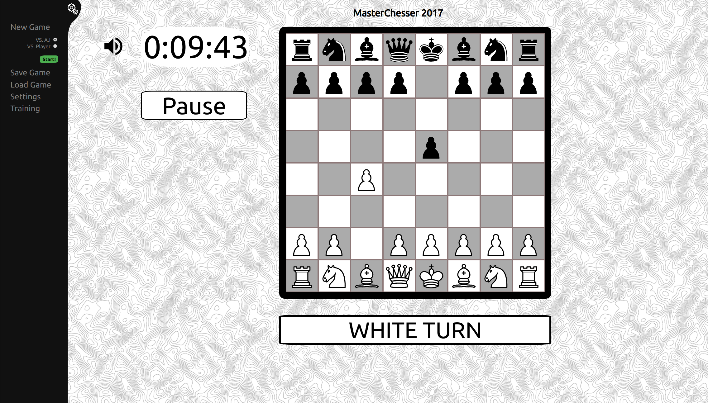

# README

This is fully featured Chess-game running on HTML5 and JavaScript.
Game was made for usability course in the University of Oulu some years ago.

Backend A.I is just for "fun", responding with random legal moves.

There are probably a lot of bugs.

